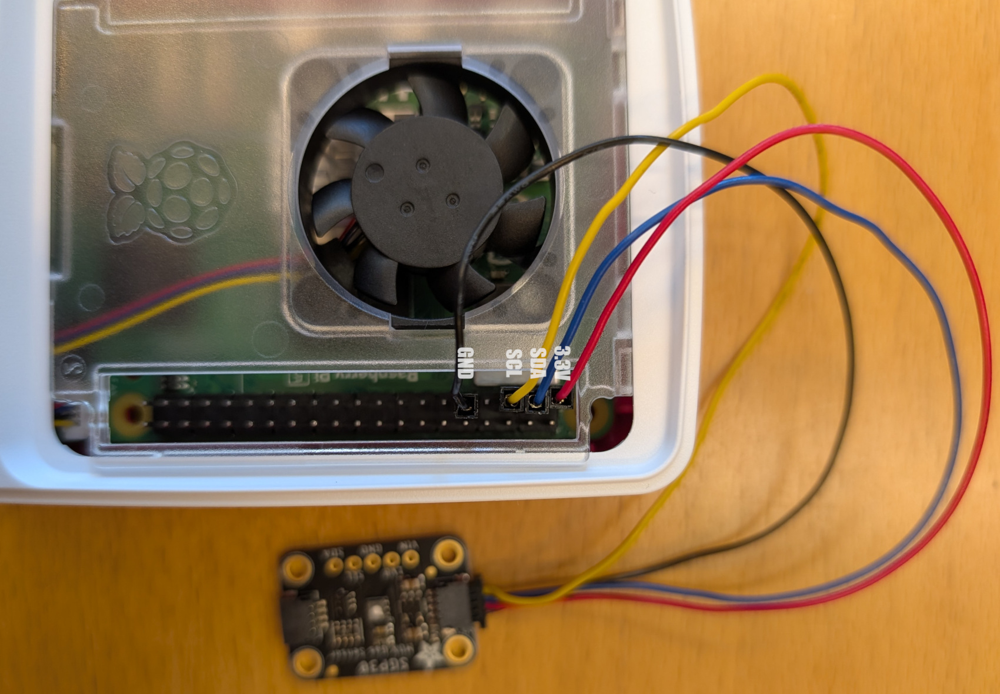
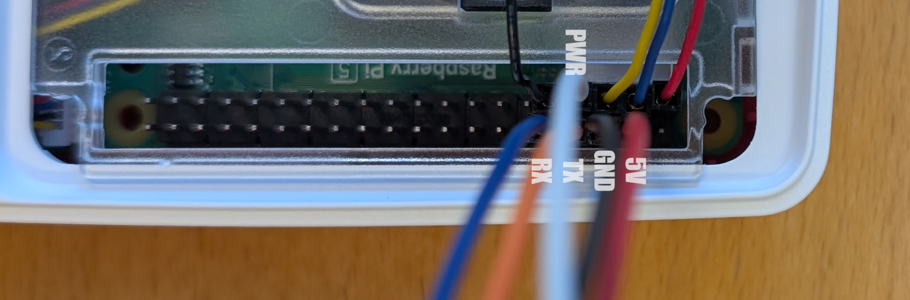
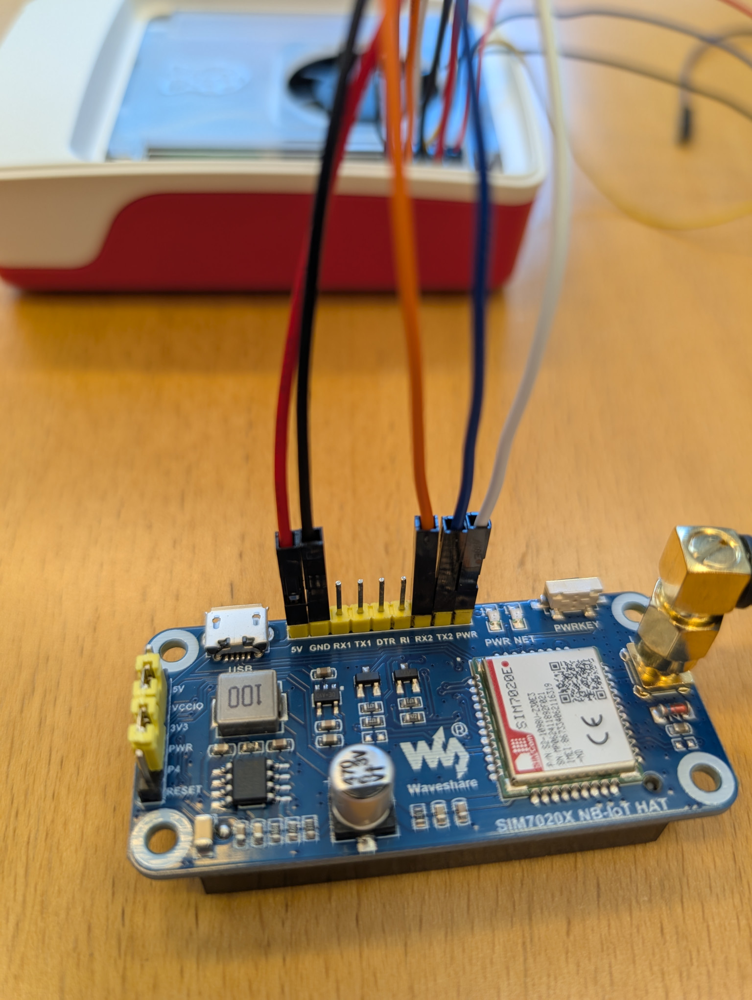

# aau_ubiss

In the full setup folder you can run "docker-compose up -d"
This will create the full background functionalities of a server to receive data from users.
Running this command should, i believe, download the appropriate docker images, otherwise get in touch with me and i can help out with how to download them.

The data reception happens in the subscriber container, which fundamentally be removed and run locally instead. In the "fullsetup/subscriber.py" handling of received messages occur and insertion into the database (mongodb) happens. It can be altered to better fit things for you if you feel the need. Requirements currently in the programming logic is a sample and timestamps are sent in pairs together, or that a single timestamp is sent along with the samples for logging purposes. This could be altered if it seems unnecesary to you.
If you do this, you may want to rebuild the docker image. This is done by going into the "fullsetup/sucscriber" folder, and running dockerbuild.sh.

I would suggest leaving the mosquitto, mongodb, and filehosting as is. They simply work in the background to facilitate messaging, storage and exposing the logged data. 

Special scripts like "download.py" will acquire the data in the database for a specific "userid", which is a tag sent along for data handling purposes.
The script "/fullsetup/delete.py" takes the variable in the file "group" and deletes that group of data entries on the database. More finegrained deletion can also be applied,
but this simply deletes everything at once.
The script "fullsetup/show_collections.py" gives some generic information on the datafiles logged in the system, specifically the "tag" for the datatypes submitted.


Things in the examples folder will not work, as these utilized specific sensor API. As we are ordering the sensors currently some of these may become useful again, but i inserted a randomly generated number in the root folder for publisher.py so you can do some simple tests early on on your own.

## Setup Raspberry PI

Start by updating the PI

```bash
sudo apt update
sudo apt upgrade
```

Make sure you have Python and pip installed

```bash
sudo apt install python3 python3-pip git
```


### Enable UART and I²C

```bash
sudo raspi-confg
```

- Go to interface options  
- Select `I2C`
  -  Press `yes` to enable.  
- Go to interface options
- Select `Serial Port`
  - Press `no` to login shell
  - Press `yes` to enable Serial port
- Select `<Finish>`
- Select `<Yes>` to reboot
  
### Install IoT Testbed

```bash
git clone https://github.com/andreascas/aau_iot.git
cd aau_iot
```

You need to install the board support crate, for IoT and sensor support.  
It is recommended to install the package into a conda or virtual environment.

```bash
cd board_support_crate
pip install .
cd ..
```

## Wiring
Start by connecting the QWIIC connector, by matching the colors as below:



Follow up by connecting the SIM7020E modem from waveshare


Match the colors to the pinout on the modem

