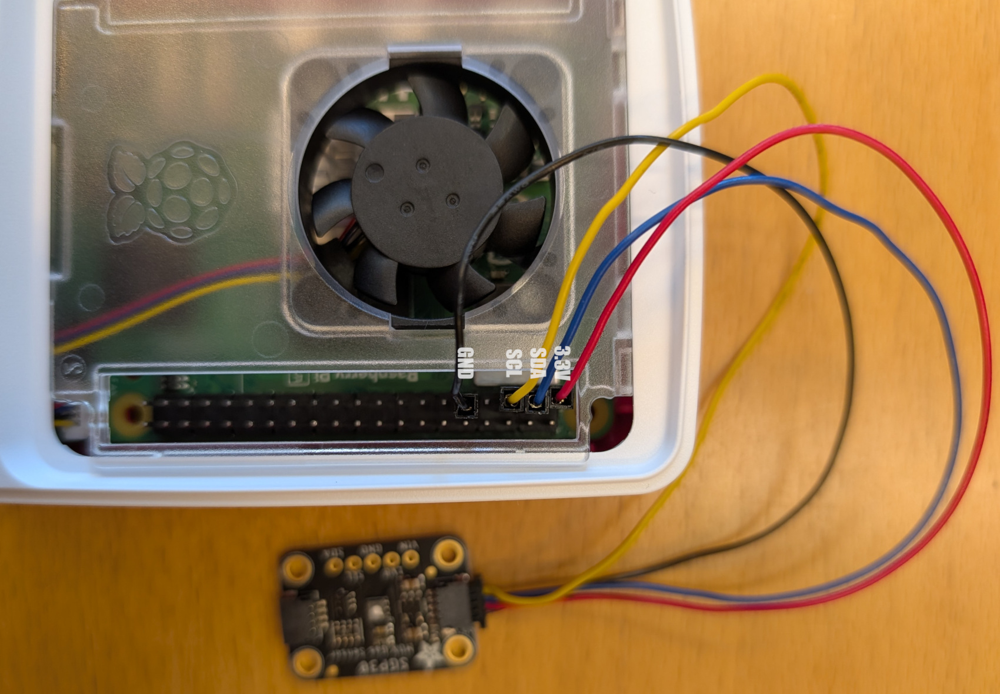
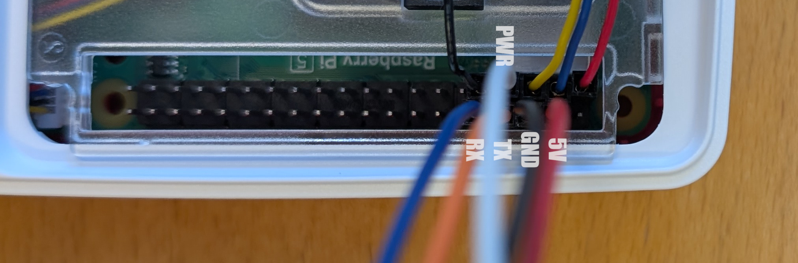
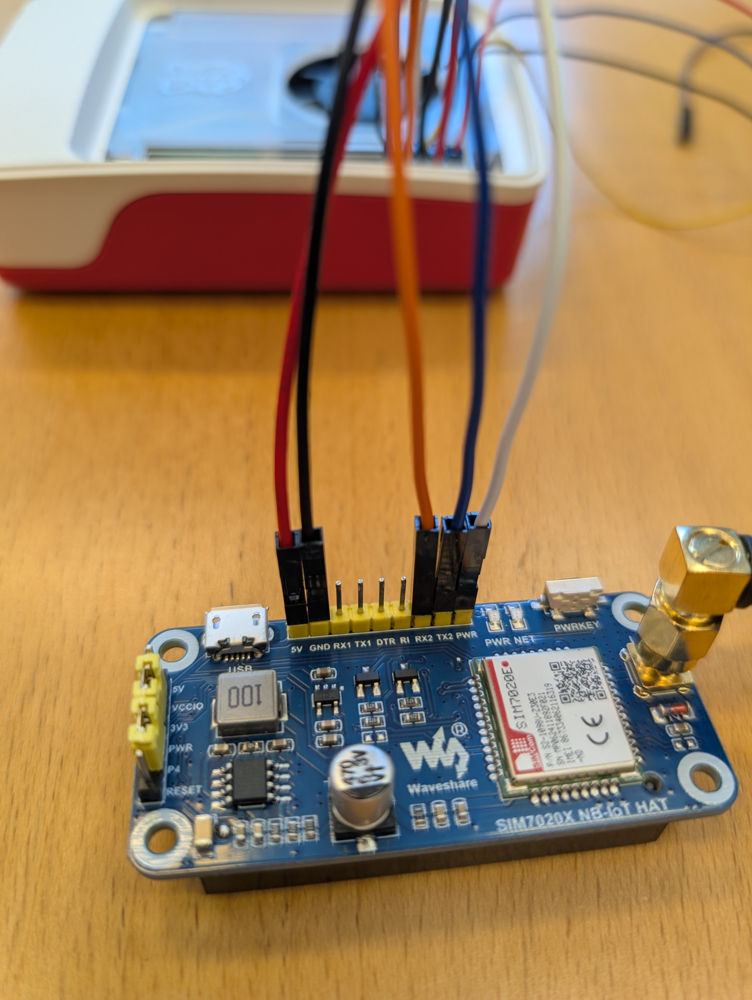

# AAU IoT Testbed

## Getting started

Each group has been given a kit containing a Raspberry Pi 5 and sensors, which are preconfigured with the required software.  

The wired interface has been set to a static ip: `192.168.2.2`. To access the device over SSH, connect a Ethernet cable to your laptop and setup a manual connection (See: [Win](https://www.howtogeek.com/19249/how-to-assign-a-static-ip-address-in-windows/), [Linux](https://www.ubuntumint.com/ubuntu-ip-address/)).

Connect with:

```bash
ssh pi@192.168.2.2
```

Default password is `raspberry`

To wire up the kit see [Wiring](#wiring).

### Usage

After you have wired the kit up, you can find the API and test it in `/examples`.

Remember to change the server to `130.225.37.202`, if you wish to use the broker hosted at AAU and the group field to your groupid: `'comtek-6-xxx'`.

- If you wish to selfhost the broker find a docker setup guide at [/fullsetup](fullsetup)

To download your data from the server you have three options:
1. run `./download.py --group <id> --server <ip>`  
2. Call the download function, see [/examples/usage.ipynb](examples/usage.ipynb)
3. To download on your own PC follow the section ["Install IoT Testbed"](#install-iot-testbed) and use the script in [/fullsetup/download.py](fullsetup/download.py).


## Setup Raspberry PI

Start by updating the PI

```bash
sudo apt update
sudo apt upgrade
```

Make sure you have Python and pip installed

```bash
sudo apt install python3 python3-pip git
```

### Enable UART and I²C

```bash
sudo raspi-confg
```

- Go to interface options  
- Select `I2C`
  -  Press `yes` to enable.  
- Go to interface options
- Select `Serial Port`
  - Press `no` to login shell
  - Press `yes` to enable Serial port
- Select `<Finish>`
- Select `<Yes>` to reboot
  
### Install IoT Testbed

```bash
git clone https://github.com/andreascas/aau_iot.git
cd aau_iot
```

You need to install the board support crate, for IoT and sensor support.  
It is recommended to install the package into a conda or virtual environment.

```bash
cd board_support_crate
pip install .
cd ..
```

## Wiring
Start by connecting the QWIIC connector, by matching the colors as below:



Follow up by connecting the SIM7020E modem from waveshare


Match the colors to the pinout on the modem

